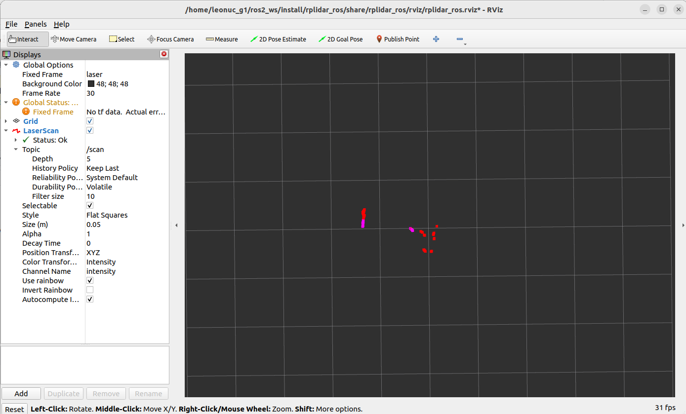

# Integration with NUC
<h1 align="center"> Using RPLidar with ROS2 </h1>
This section is dedicated to the installation and usage of RPLidar on your NUC. Once you complete this section, you will be able to visualize RPLidar data with Rviz.

## Step 1: Creating a ROS2 Workspace and Building the Lidar Package ##
Create ros_ws

```
mkdir -p ~/ros2_ws/src
cd ~/ros2_ws/src
```
Clone lidar repo

```
git clone -b ros2 https://github.com/Slamtec/rplidar_ros.git
```

Build lidar package

```
cd ..
colcon build --symlink-install
```
## Step 2: Sourcing Local Workspace ##
Source local environment

```
source ./install/setup.bash
```
## Step 3: Adding Udev Rules for RPLidar ##
Create udev rules for rplidar

```
sudo chmod 777 /dev/ttyUSB0
```
```
cd src/rplidar_ros/
source scripts/create_udev_rules.sh

```
## Step 4: Launching RPLidar Node and Visualizing Data with Rviz ##
Now, you can launch the lidar node by

```
ros2 launch rplidar_ros view_rplidar_a2m12_launch.py
```
You should see the following Rviz screen. Move the lidar to see how it updates the measurements in Rviz..



# Direct Integration with the Rover
## Wiring and electronics connection
The sensor can be connected to the robot's main computer via the USB socket positioned at the top of the rover. If your USB cable is long it might get into lidars field of view if it sticks up too much. try to hide it in the empty space inside Leo Rovers back frame. Just like on the photo below:


USB connection provides power to the sensor and allows the data transfer. This means that no external power sources are necessary. However, some lidars might need external power connections, that's when powerbox might come in handy.

With everything connected you are ready to try out your new sensor.

## Software integration
The first thing you can do is to make sure your device has the correct permissions and is available at the fixed path on your system. To do this, you can add the following rule to the udev service:
```
KERNEL=="ttyUSB*", ATTRS{idVendor}=="10c4", ATTRS{idProduct}=="ea60", MODE="0666", GROUP="dialout", SYMLINK+="lidar"
```
Paste these lines to /etc/udev/rules.d/lidar.rules file and reload udev rules by typing:
```
sudo udevadm control --reload-rules && sudo udevadm trigger
```
Your device should now be available at the /dev/lidar path.

We want the sensor functionality to be available in the ROS ecosystem, so you should install a ROS package that provides a node for the sensor you are trying to integrate.
```
sudo apt install ros-humble-rplidar-ros
```
Now, create a launch file that would start the node with a fitting configuration.
```
from launch import LaunchDescription
from launch_ros.actions import Node

def generate_launch_description():
    return LaunchDescription([
        Node(
            package='rplidar_ros',
            executable='rplidarNode',
            name='rplidar_node',
            output='screen',
            parameters=[
                {'serial_port': '/dev/lidar'},
                {'frame_id': 'laser_frame'}
            ]
        ),
    ])
```
Include your launch file in the robot.launch.py file, so that your node will start at boot
Your robot should be aware of where the sensor is located and what space it occupies. You can ensure it does that by creating a URDF model of the sensor.
filename = **/etc/ros/urdf/laser.urdf.xacro**
```
<?xml version="1.0"?>
<robot>

  <link name="rplidar_link">
    <visual>
      <origin xyz="0 0 0.003"/>
      <geometry>
        <box size="0.079 0.086 0.006"/>
      </geometry>
      <material name="support">
        <color rgba="0.5 0.5 0.5 1.0"/>
      </material>
    </visual>
    <visual>
      <origin xyz="0 0 0.023"/>
      <geometry>
        <cylinder radius="0.038" length="0.04"/>
      </geometry>
      <material name="lidar">
        <color rgba="1.0 0.0 0.0 0.7"/>
      </material>
    </visual>
    <collision>
      <origin xyz="0 0 0.003"/>
      <geometry>
        <box size="0.079 0.086 0.006"/>
      </geometry>
    </collision>
    <collision>
      <origin xyz="0 0 0.023"/>
      <geometry>
        <cylinder radius="0.038" length="0.04"/>
      </geometry>
    </collision>
  </link>

  <joint name="rplidar_joint" type="fixed">
    <origin xyz="0.0775 0 0"/>
    <parent link="base_link"/>
    <child link="rplidar_link"/>
  </joint>

  <link name="laser_frame"/>

  <joint name="laser_joint" type="fixed">
    <origin xyz="0 0 0.0368" rpy="0 0 ${pi}"/>
    <parent link="rplidar_link"/>
    <child link="laser_frame"/>
  </joint>

</robot>
```
And including it in the description that is uploaded at boot.
filename = **/etc/ros/urdf/robot.urdf.xacro**
```
<xacro:include filename="/etc/ros/urdf/laser.urdf.xacro"/>
```
The last step is to either reboot the robot or restart the leo service.
```
sudo systemctl restart leo
```
