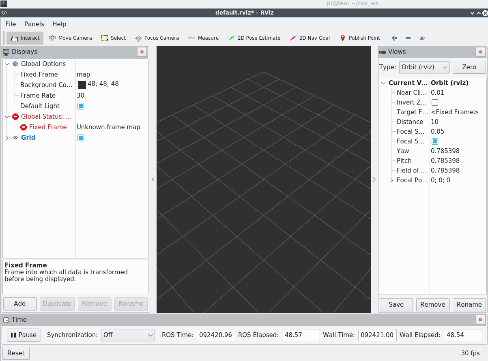
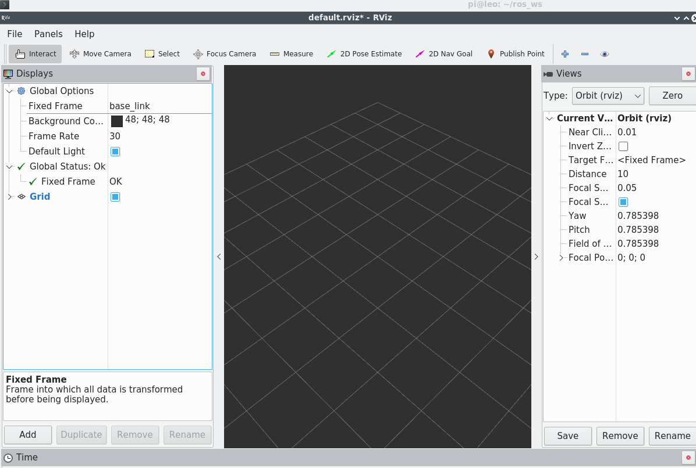
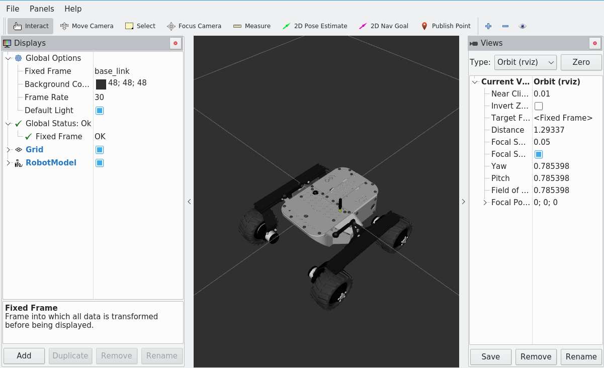
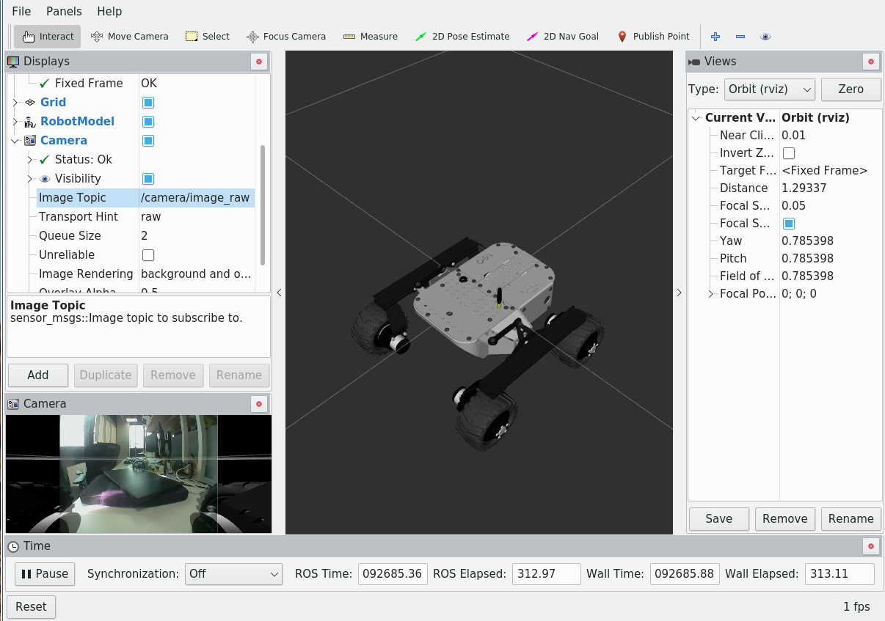
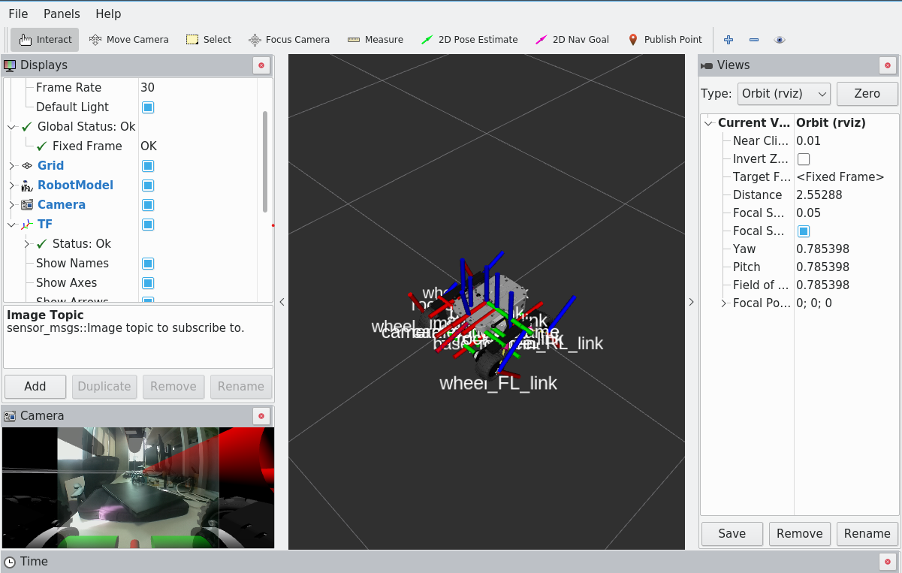

<h1 align="center" > Controlling Robot with ROS 2 </h1>

In this section, you will create your first ROS workspace and ROS package. Within your ROS package, you will write a ROS node in Python to move the robot forward and backward at specified intervals. After completing this section, you will also learn how to create launch file and  visualize the robot in RViz.

## Step 1: Creating ROS 2 Workspace and Creating ROS 2 Package ##

First, we create a ROS 2 workspace to build our ROS 2 package that we will develop in the following steps.

Create workspace folders
```
mkdir -p ros2_ws/src
```

Create package

```
cd ros2_ws/src
ros2 pkg create ros_basics --build-type ament_python --dependencies std_msgs rclpy
```
The name of the package is **ros_basics**, and it depends on **std_msgs** and **rclpy** packages. Now, go to the created package and create a scripts folder where you will place the Python code.
```
cd ros_basics
mkdir scripts
```
Create a Python script with the name **move_robot.py** (with the .py extension) inside **scripts** folder to write Python code.
```
cd scripts
gedit move_robot.py
```
Copy the following code inside **move_robot.py** script:
```
#!/usr/bin/env python3

import rclpy
from geometry_msgs.msg import Twist  ## cmd_vel topic accepts Twist type messages
class BasicROS:
   def __init__(self):
      self.counter=0          ## Counter variable to count the number of timer callbacks   
      self.counter_period=5   ## Change the direction every 5 count
      self.switch_direction=False  ## If this is True, the robot will change direction (forward or backward)
      self.vel_step=0.1       ## Movement speed of the robot
      self.twist_cmd = Twist()
      self.cmd_vel_pub = rclpy.Publisher("cmd_vel", Twist, queue_size=1)  ## Velocity command publisher
      self.timer_period=1 
      self.timer = rclpy.Timer(rclpy.Duration(self.timer_period), self.timer_callback)  ## The timer interrupt. timer_callback function is called every self.timer_period seconds.

   def timer_callback(self,event):
       if self.counter%self.counter_period==0:
          self.switch_direction=True
       else:
          self.switch_direction=False
       self.move_robot()
       self.counter+=1
  
   def move_robot(self):
       self.vel_step=-self.vel_step if self.switch_direction else self.vel_step
       self.twist_cmd.linear.x = self.vel_step
       self.twist_cmd.angular.z = 0.0
       self.cmd_vel_pub.publish(self.twist_cmd)
       

if __name__=="__main__":

  rclpy.init_node('move_robot_node')
  try:
    BasicROS()
    rclpy.spin()
  except rclpy.ROSInterruptException:
    print("ROS 2 Node Error")
```
Now, write the following command to grant permission to execute the Python file:

```
chmod +x move_robot.py
```
Finally, build the package:
```
cd
cd ros2_ws
colcon build
```

## Step 2: Visualize The Robot ##

Open a new terminal and run RViz.
```
source ros2_ws/devel/setup.bash
rviz2
```
Now, you should see the following RViz window:



Change **Fixed Frame** from **map** to **base_link**



Now, add robot model to visualize the robot



You can also show Camera Data and Robot Transformation. Explore what you can visualize with RViz.

Camera Data



Tf Data



You can save RViz configurations to launch it directly. To do that, create a new folder named 'rviz' inside your package.

```
cd ros2_ws/src/ros_basics
mkdir rviz
```
In rviz, go to **File -> Save Config As -> ros2_ws/src/ros_basics/rviz** 

Write **leo_rover.rviz** as the file name.

## Step 3: Launch File ##

You can create a launch file to start the **move_robot.py** ROS 2 node and load the saved RViz configuration. To do that, first create a **launch** folder.
```
cd ros2_ws/src/ros_basics
mkdir launch
```

Create a launch file

```
cd launch
gedit robot_move.launch.py
```
and copy following
```
import launch
from launch import LaunchDescription
from launch_ros.actions import Node

def generate_launch_description():
    return LaunchDescription([
        Node(
            package='ros_basics',
            executable='move_robot.py',
            name='robot_node',
            output='screen'
        ),
        Node(
            package='rviz2',
            executable='rviz2',
            name='rviz2',
            output='screen',
            arguments=['-d', 'ros_basics/rviz/leo_rover.rviz']
        )
    ])
```
now you can source your workspace and load your launch file by

```
cd
cd ros2_ws
source devel/setup.bash
ros2 launch ros_basics robot_move.launch.py
```
