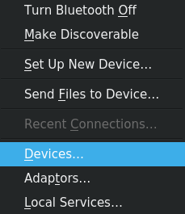
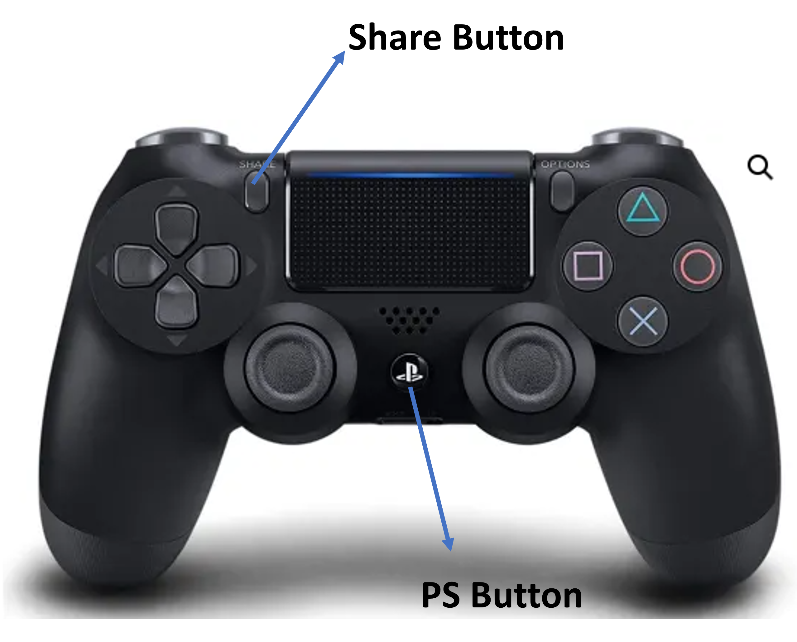
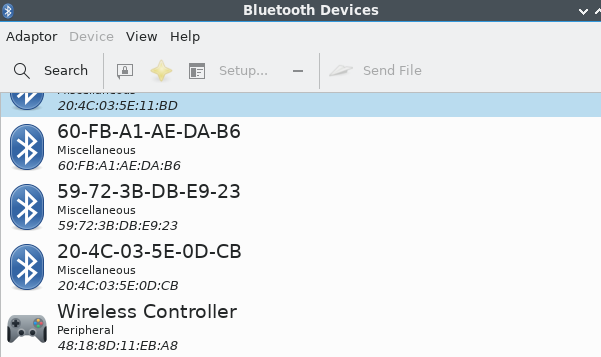
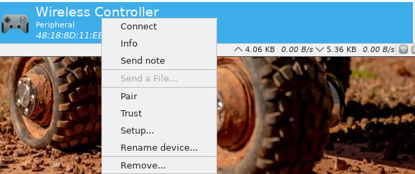
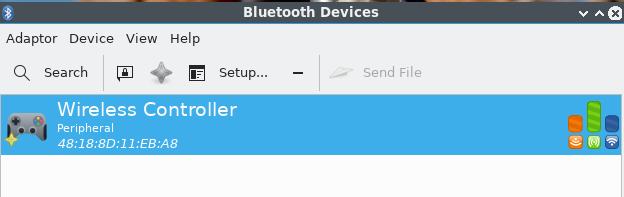
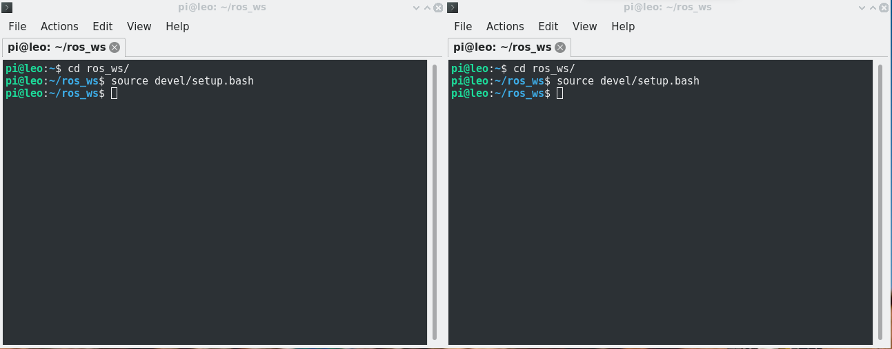
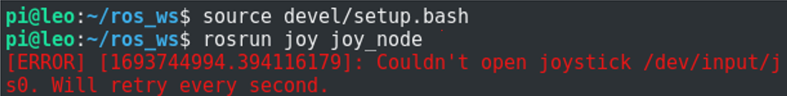
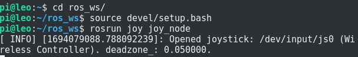
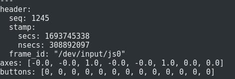
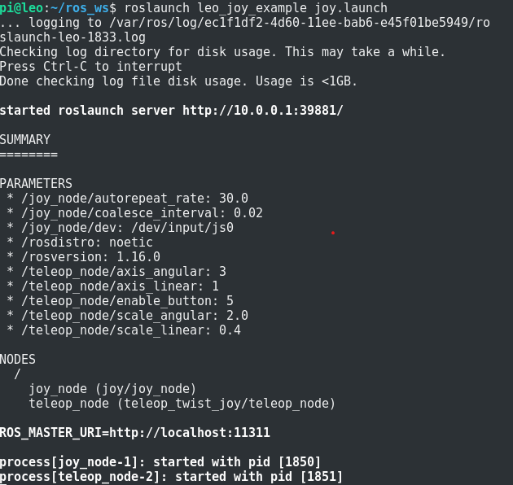

<h1 align="center"> Steering with Joystick </h1>

This section is dedicated to controlling LeoRover using a PS4 controller. In the previous section, you created a workspace and a package to move the robot using ROS topics. In this section, you will create a new package to move the robot using ROS and a joystick (PS4). After successfully completing this section, you will be able to control your robot using a PS4 controller.

**Important Note: Please use Remote Desktop Connection instead of PuTTY, as you will need to create multiple terminal windows.**


## Step 1: Creating ROS2 Workspace ##

Continue to use the existing workspace "ros2_ws", create a new package
```
cd ros2_ws/src
ros2 pkg create leo_joy_example --build-type ament_python --dependencies joy teleop_twist_joy
```

Update workspace

```
cd ..
rosdep update
rosdep install --from-paths src -y --ignore-src
```

Create launch folder

```
cd src/leo_joy_example
mkdir launch
```

Create launch file

```
cd launch
gedit joy.launch.py
```

Copy the following code into **joy.launch.py** file:

```
import launch
from launch import LaunchDescription
from launch_ros.actions import Node

def generate_launch_description():
    cmd_vel_topic = "/cmd_vel"  # Change this if needed

    joy_node = Node(
        package='joy',
        executable='joy_node',
        name='joy_node',
        parameters=[{'dev': '/dev/input/js0', 'coalesce_interval': 0.02, 'autorepeat_rate': 30.0}]
    )

    teleop_node = Node(
        package='teleop_twist_joy',
        executable='teleop_node',
        name='teleop_node',
        parameters=[{'cmd_vel_topic': cmd_vel_topic}],
        remappings=[('cmd_vel', cmd_vel_topic)]
    )

    return LaunchDescription([joy_node, teleop_node])
```
press **Ctrl+o** , **Enter**, **Ctrl+x**

Create configuration folder
```
cd ..
mkdir config
```

Create configuration file
```
cd config
gedit joy_mapping.yaml
```

Copy the following configurations into  **joy_mapping.yaml** file:

```
axis_linear: 1
scale_linear: 0.4
axis_angular: 3
scale_angular: 2.0
enable_button: 5
```
press **Ctrl+S** , and close the window

Finally, build the workspace

```
cd
cd ros2_ws
colcon build
```

## Step 2: Bluetooth Connection ##

To establish a Bluetooth connection between the PS4 controller and the Raspberry Pi, right-click on the Bluetooth icon in the bottom right corner and click **Devices**.



Press the PS and Share buttons on the PS4 controller simultaneously until the LED starts blinking. See the buttons below:



then search for the devices. It will find **Wireless Controller**.



Right click on **Wireless Device** click **Pair** and **Trust** in order.



Now your controller is connected to the Raspberry Pi and added as a trusted device. Now you should see the following:



## Step 3: Running ROS2 Nodes ##

First, open two terminal windows and source the workspace in both terminals.
```
cd ros2_ws
source devel/setup.bash
```


Type following command in one of the terminal to run ros joystick node joy_node:

```
rosrun joy joy_node
```
If you see following output, your controller is disconnected from the raspberry. 


In this case, reconnect you controller by using bluetooth settings. Please note that when connecting PS4 always push **PS** and **Share** button until it blinks and click connect afterwards. The output should be as follows



Now, listen to the **/joy** topic in the second terminal.

```
ros2 topic echo /joy
```

You will notice that as you press buttons on your controller, data will be published via **/joy** as follows:



First, you should investigate the relationship between buttons and axes. Then, check the configuration file **joy_mapping.yaml** that you created earlier to understand the functions of the PS4 buttons.

Now, launch the package that you created in the previous steps to control the LeoRover:

```
ros2 launch leo_joy_example joy.launch.py
```



You can open the camera broadcast on your computer to monitor your robot while driving by connecting to **10.0.0.1** via your browser.


